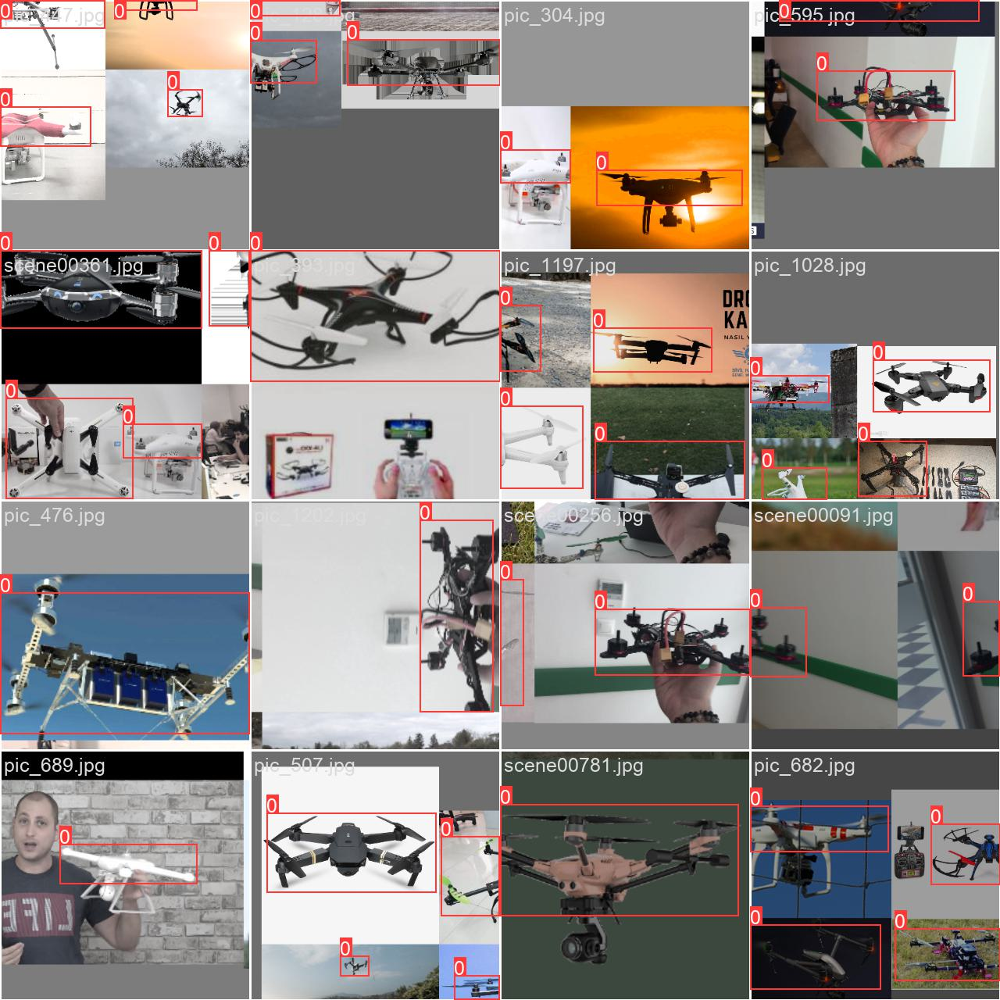
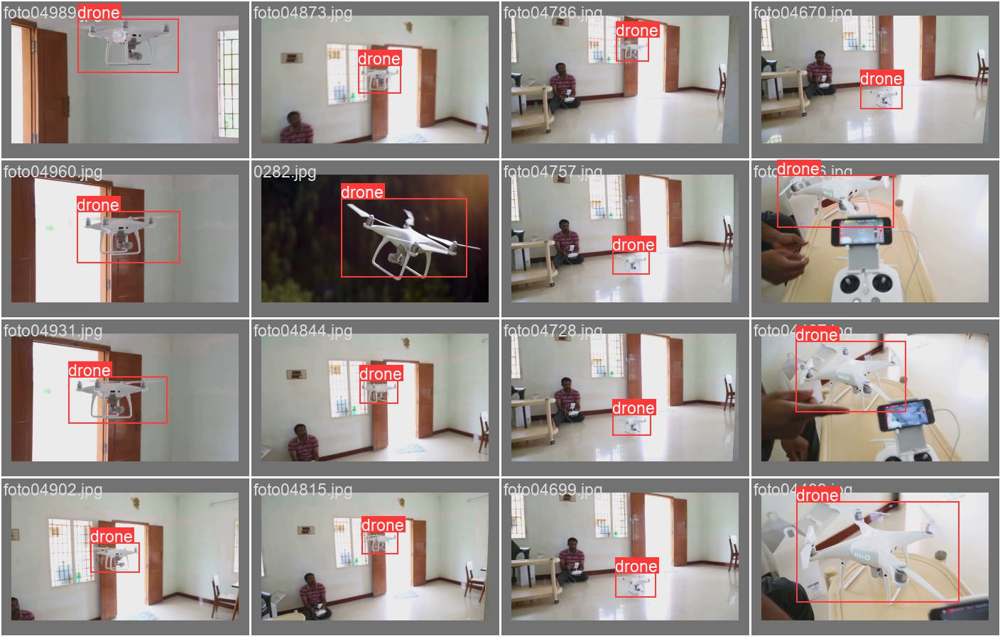
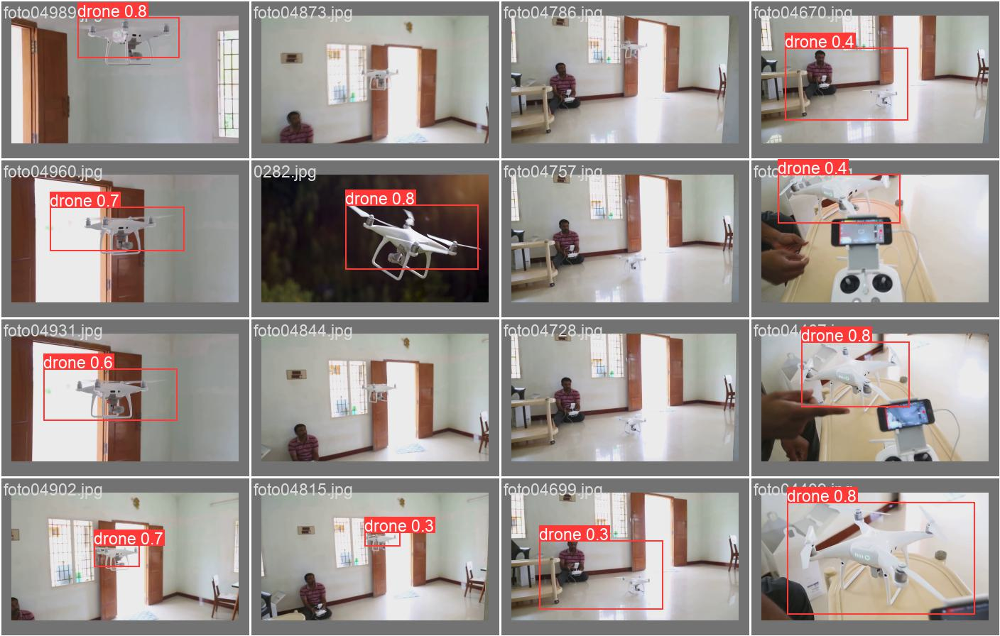
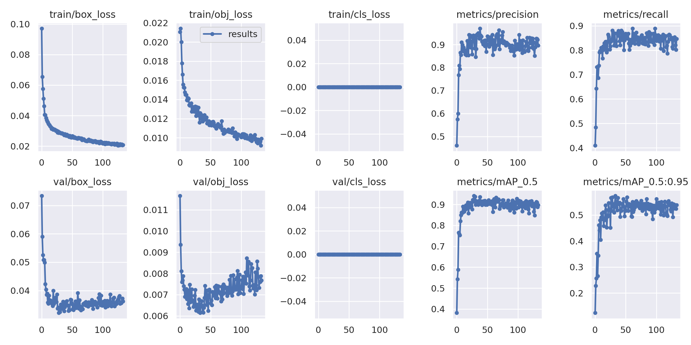

# DL lab

## Results
1. Training
   

2. Labele vs predicted

 

3. train/test matrics

## References

- https://github.com/ultralytics/yolov5
- https://docs.ultralytics.com/yolov5/train_custom_data

## Key Terms

- **Stochastic gradient descent** is an iterative learning algorithm that uses a training dataset to update a model.
- The **batch size** is a hyperparameter of gradient descent that controls the number of training samples to work through before the model’s internal parameters are updated.
- The **number of epochs** is a hyperparameter of gradient descent that controls the number of complete passes through the training dataset.

